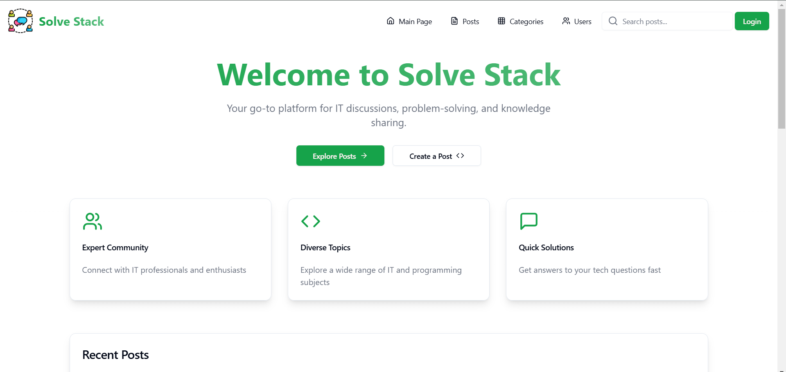
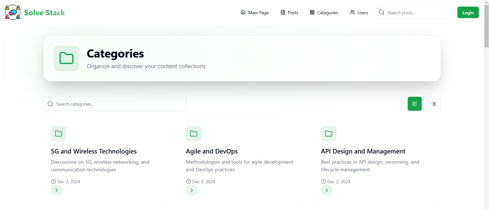
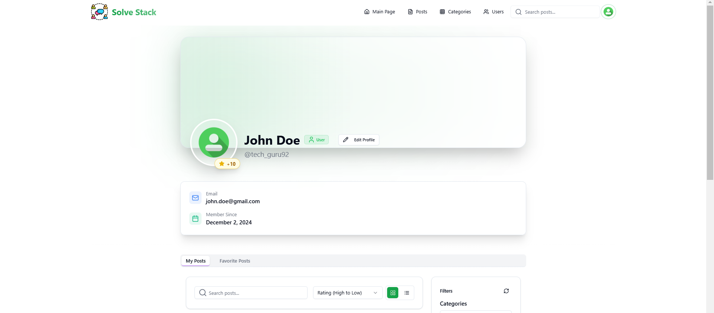
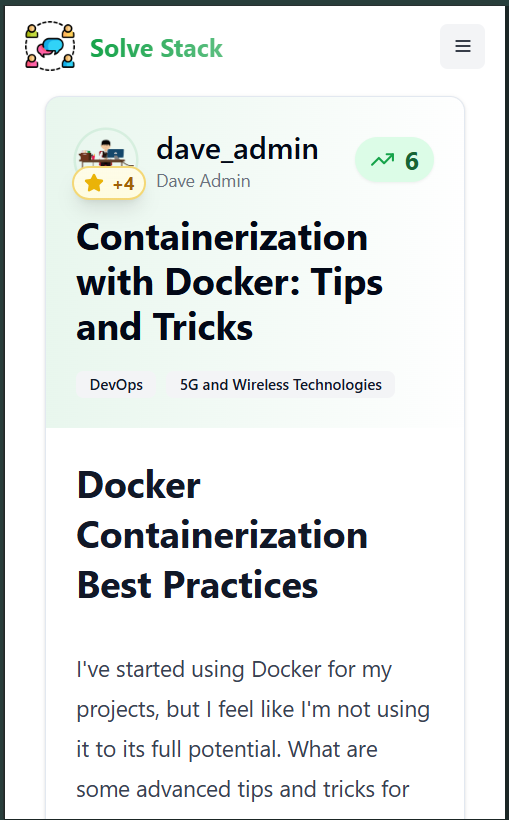
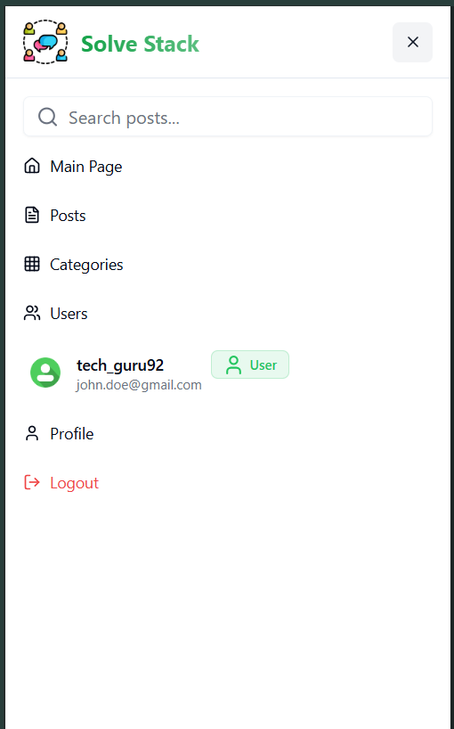
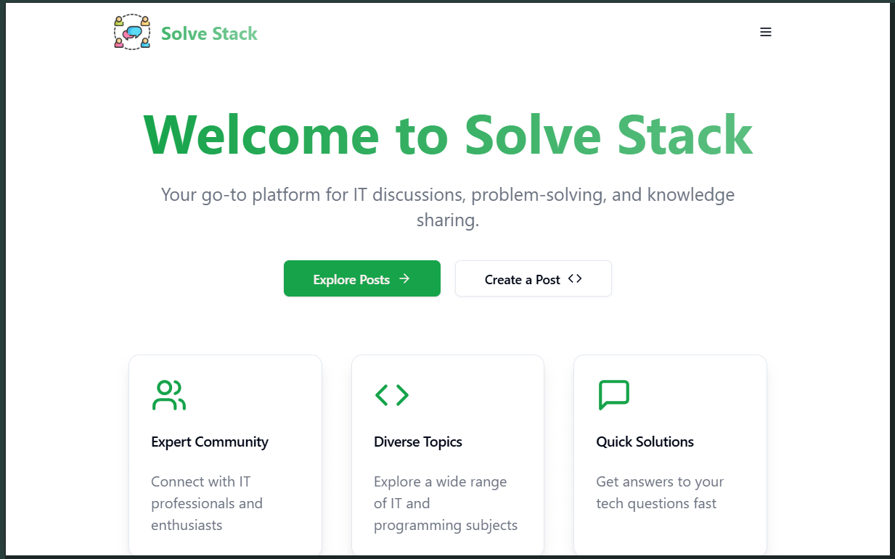

# USOF Frontend

**Solve Stack** is a frontend application for a Q&A platform designed for programmers and IT enthusiasts to share knowledge and solve technical problems.

## Table of Contents
- [Overview](#overview)
- [Features](#features)
- [Requirements and Dependencies](#requirements-and-dependencies)
- [Setup Instructions](#setup-instructions)
- [Usage](#usage)
- [Authentication](#authentication)
- [Sample Credentials](#sample-credentials)
- [AdminJS Interface](#adminjs-interface)
- [Nodemailer Integration](#nodemailer-integration)
- [API Documentation](#api-documentation)

## Overview
The **Solve Stack Frontend** provides a modern, responsive user interface for interacting with the Solve Stack backend API. It offers a seamless experience for users to create, browse, and engage with programming-related posts and discussions.

## Features
- **Responsive Design**: Mobile and desktop-friendly interface.
- **User Authentication**: Secure login and registration.
- **Post Management**: Create, edit, and browse posts.
- **Rich Text Editing**: Integrated text editor for post creation.
- **Search Functionality**: Advanced post search capabilities.
- **Role-Based Access Control**: Different UI experiences for guests, users and admins.
- **State Management**: Centralized Redux state management.
- **Favorite Posts**: Users can add posts to their favorites.

## Requirements and Dependencies
- **Node.js** (v14+ recommended)
- **NPM** (v10+ recommended)
- **MySQL** (v8+ recommended)

Before starting, ensure the required technologies are installed.

## Setup Instructions

Ensure the [Solve Stack Backend](https://github.com/Kolesnichenko0/ucode-connect-Connect-FullStack-usof-backend/blob/main/README.md) is set up and running before starting the frontend. The frontend application requires a running backend API to function correctly.
To run this project locally, follow these steps:

1. **Clone the Repository**:
   ```bash
   git clone ...
   ```
2. **Install All Dependencies**:
   ```bash
   npm install
   ```

3. **Launch the Application**:
    ```bash
    npm run dev
    ```
## State Management
Utilizes Redux for centralized state management:

- **Authentication state**
- **User profile information**
- **Post and comment data**
- **Global application settings**

## API Integration
**Axios** is used for HTTP requests to the backend API:

- **Centralized API service**
- **Interceptors for request/response handling**
- **Error management**
- **Authentication token management**

## Authentication
- **JWT-based authentication**
- **Protected routes for authenticated users**
- **Role-based access control**
- **Secure token storage and management**

## Sample Credentials
There are some logins for testing purposes:
- **User**: tech_guru92, jane_dev
- **Admin**: alice_admin, henry_dev

Default test data includes users with the password: `qwerty123Aa@`.

## Screenshots
### Home page

### Categories page

### Posts page

### Create post page

### Profile page

### Post page

### Post comments

### Mobile post page

### Mobile menu page

### Tablet home page

### Tablet users page
